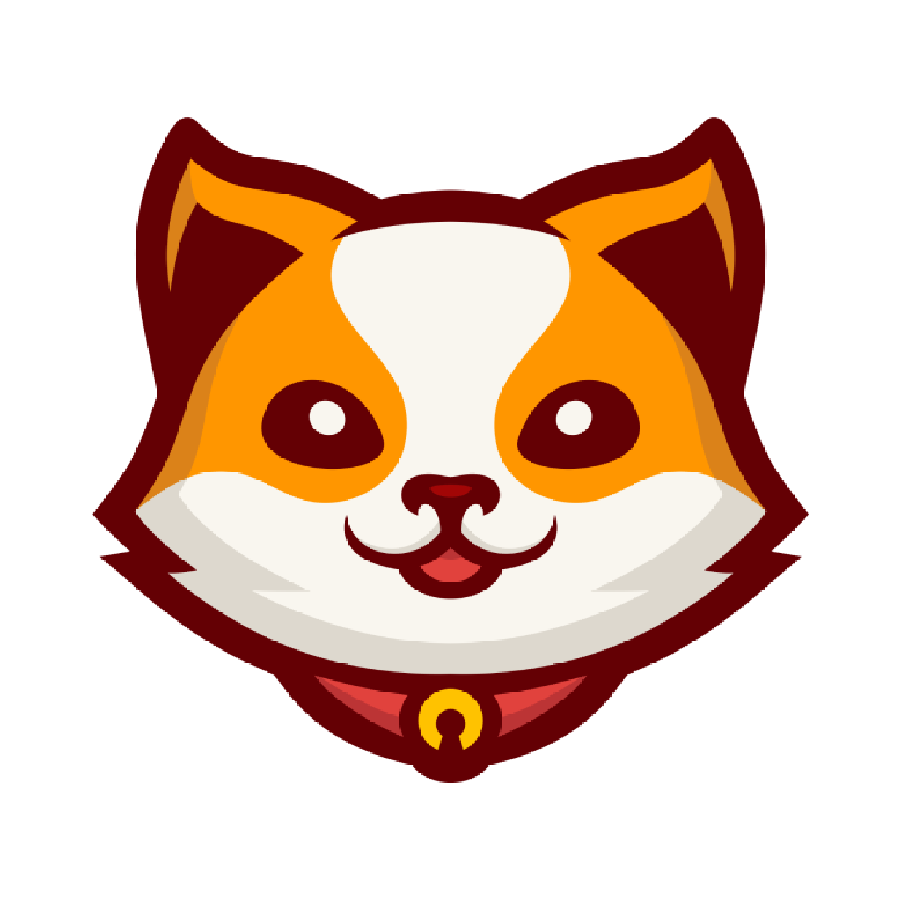
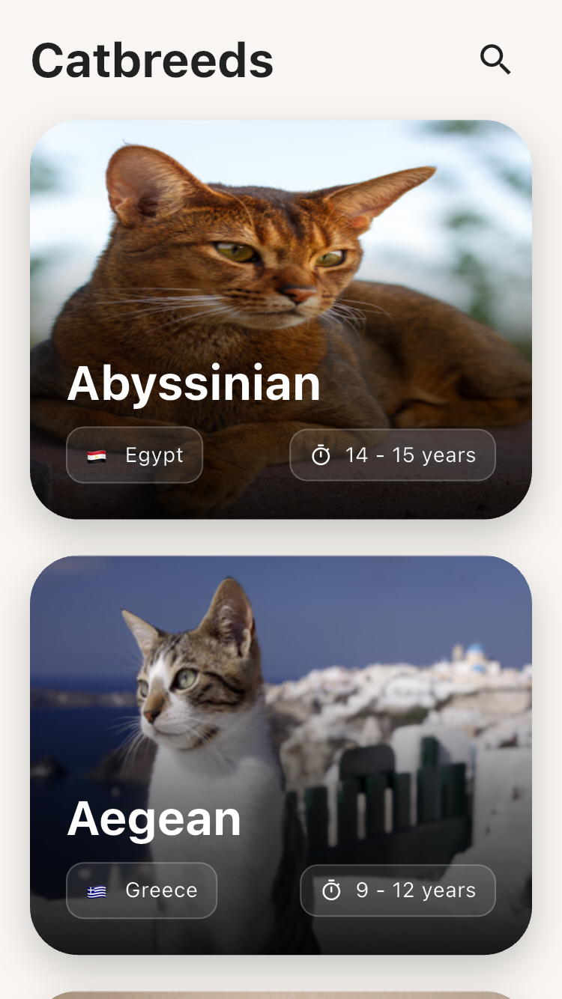
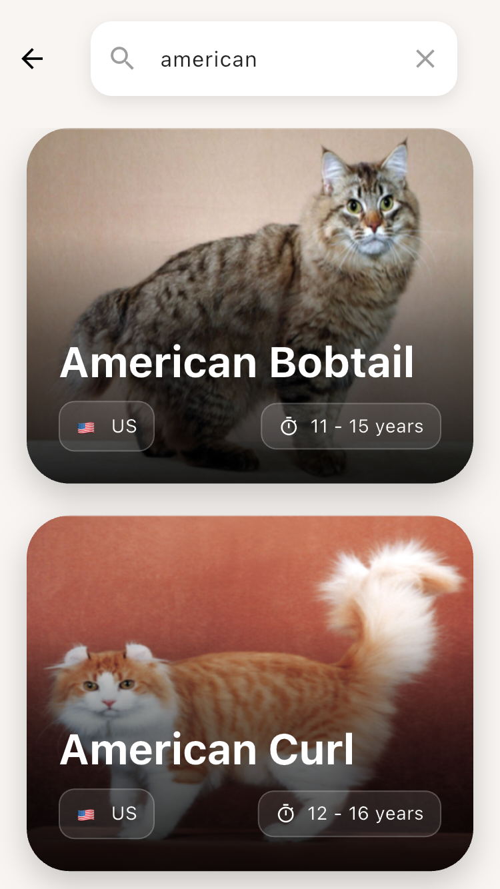
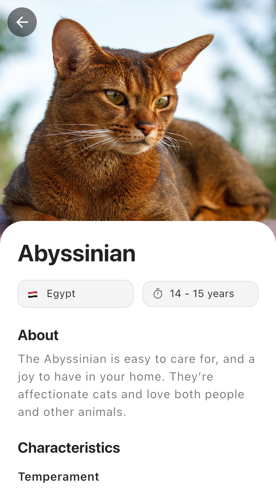

# Cat Breeds App

<div align="center">



Una aplicación móvil elegante para explorar razas de gatos, desarrollada con Flutter y Clean Architecture.

[](https://flutter.dev)
[](https://dart.dev)
[](https://pub.dev/packages/very_good_analysis)

</div>

## 📱 Capturas de Pantalla

<div align="center">
<table>
  <tr>
    <td align="center">
      
      <br />
      Pantalla Principal
    </td>
    <td align="center">
      
      <br />
      Búsqueda
    </td>
    <td align="center">
      
      <br />
      Detalles
    </td>
  </tr>
</table>
</div>

## Descripción
Aplicación móvil desarrollada en Flutter que muestra información sobre diferentes razas de gatos, implementando las mejores prácticas de desarrollo y arquitectura limpia.

## Características Técnicas

### Arquitectura
- **Clean Architecture** con separación clara de capas:
  - `domain`: Entidades y casos de uso
  - `data`: Implementación de repositorios y fuentes de datos
  - `presentation`: UI y lógica de presentación
  - `core`: Utilidades y configuraciones compartidas

### Gestión de Estado
- **Riverpod** para la gestión de estado
- Implementación de providers autogenerados con `riverpod_annotation`
- Manejo eficiente de estados de carga, error y éxito

### Navegación
- **go_router** para navegación declarativa
- Rutas tipadas y constantes definidas
- Manejo de navegación con estado y argumentos tipados

### UI/UX
- Diseño Material Design 3
- Componentes adaptativos para iOS/Android
- Animaciones y transiciones fluidas
- Soporte para temas claros/oscuros
- Hero animations para transiciones suaves

### Optimizaciones
- Implementación de paginación
- Caché de imágenes con `cached_network_image`
- Debouncing en búsquedas
- Manejo eficiente de memoria en imágenes

### Buenas Prácticas
- Código limpio y bien documentado
- Uso de const constructors
- Manejo adecuado de disposición de recursos
- Variables de entorno para configuración

## Requisitos Técnicos
- Flutter SDK: ^3.8.0
- Dart SDK: ^3.8.0

## Dependencias Principales
```yaml
dependencies:
  flutter_riverpod: ^2.6.1
  go_router: ^15.1.2
  cached_network_image: ^3.4.1
  flutter_dotenv: ^5.2.1
  http: ^1.4.0
```

## Estructura del Proyecto
```
lib/
├── core/
│   ├── routes/
│   ├── theme/
│   └── utils/
├── data/
│   ├── models/
│   ├── repositories/
│   └── sources/
├── domain/
│   ├── entities/
│   ├── repositories/
│   └── usecases/
└── presentation/
    ├── common/
    │   ├── widgets/
    │   └── providers/
    └── features/
        ├── home/
        ├── search/
        └── breed_details/
```

## Instalación y Configuración

1. Clonar el repositorio:
```bash
git clone [URL_DEL_REPOSITORIO]
```

2. Instalar dependencias:
```bash
flutter pub get
```

3. Configurar variables de entorno:
- Crear archivo `.env` en la raíz del proyecto
- Agregar las variables necesarias:
```env
API_KEY=tu_api_key_aqui
API_URL=https://api.ejemplo.com
```

4. Generar código:
```bash
dart run build_runner build --delete-conflicting-outputs
```

5. Ejecutar la aplicación:
```bash
flutter run
```

## Características Implementadas

- [x] Listado de razas de gatos con paginación
- [x] Búsqueda de razas
- [x] Detalles de cada raza
- [x] Navegación fluida entre pantallas
- [x] Manejo de estados de carga y error
- [x] Diseño responsive y adaptativo
- [x] Optimización de recursos

## Decisiones Técnicas

### ¿Por qué Riverpod?
- Gestión de estado tipada y segura
- Mejor testabilidad y mantenibilidad
- Generación automática de código
- Manejo eficiente de dependencias

### ¿Por qué go_router?
- Navegación declarativa
- Soporte para deep linking
- Rutas tipadas y seguras
- Mejor manejo del stack de navegación

### ¿Por qué Clean Architecture?
- Separación clara de responsabilidades
- Facilita el testing
- Código más mantenible y escalable
- Independencia de frameworks

## Áreas de Mejora Potencial

- Implementación de tests unitarios y de integración
- Soporte para modo offline
- Internacionalización
- Analytics y crash reporting
- Mejoras en accesibilidad

## Autor
Jose Caldas

## Licencia
Este proyecto es privado y fue desarrollado como prueba técnica para PRAGMA.
